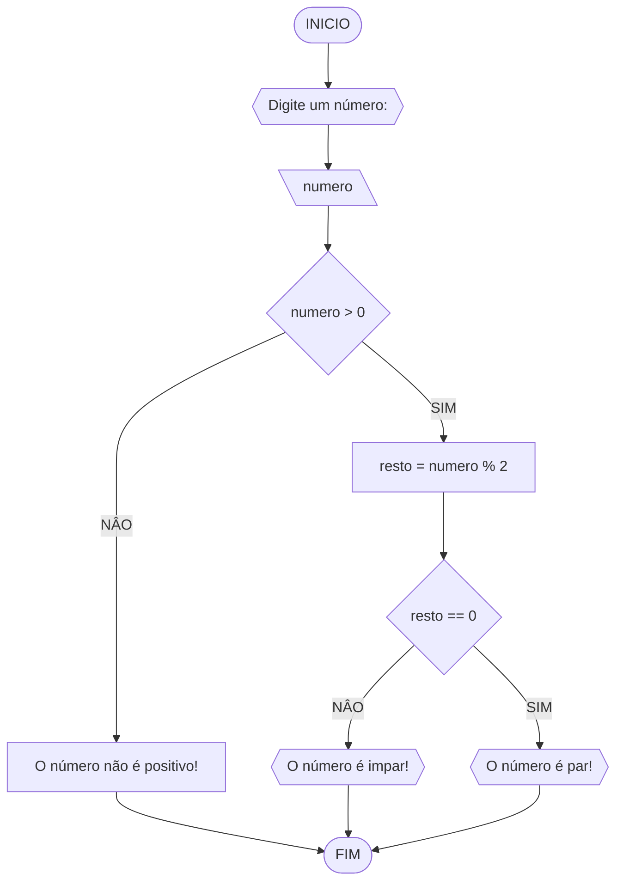

# UNIFOR
**Nome**: Nome do estudante <br>
**Disciplina**: Raciocínio lógico algorítmico

## Exercício 3
Represente, em fluxograma e pseudocódigo, um algoritmo para determinar se um número inteiro e positivo é par ou impar.

### Fluxograma



### Pseudocódigo
```
1  ALGORTIMO verifica_par_impar
2  DECLARE numero, resto NUMERICO
3  ESCREVA "Digite um número: "
4  LEIA numero
5  SE numero > 0 ENTAO
6  		resto = numero % 2
7			SE resto == 0 ENTAO
8					ESCREVA "O número é par!"
9			SENAO
10				ESCREVA "O número é impar!"
11  SENAO
12 		ESCREVA "O número não é postivo!"
13  FIM_ALGORTIMO
```
